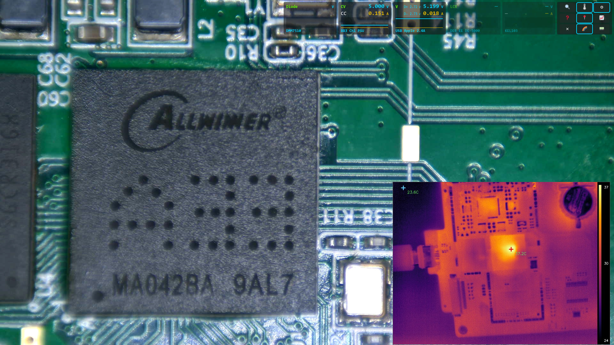
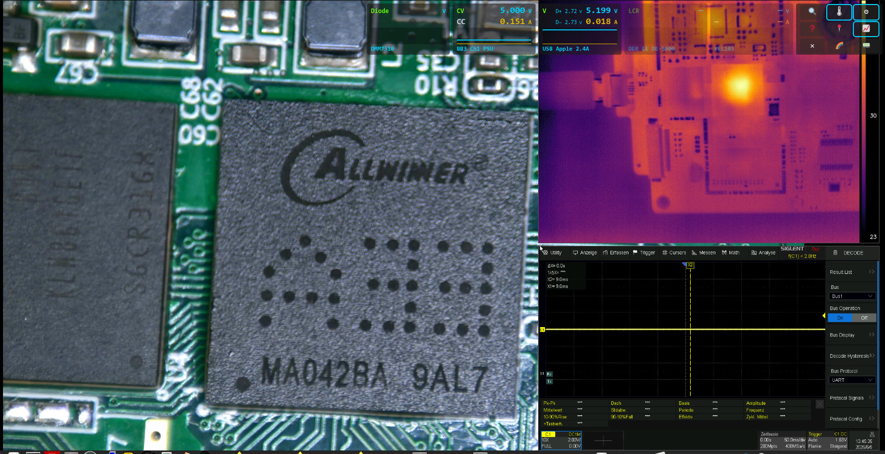
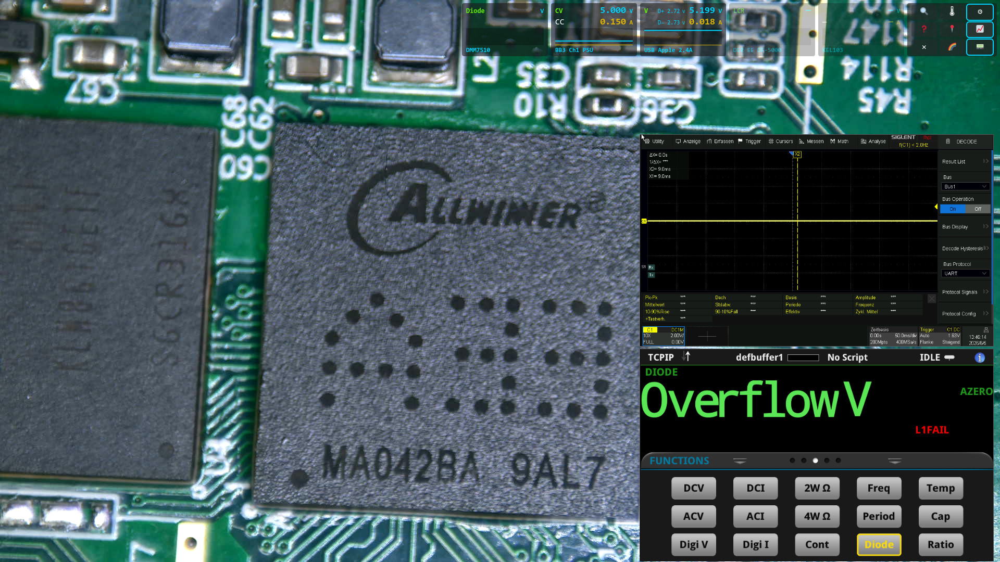
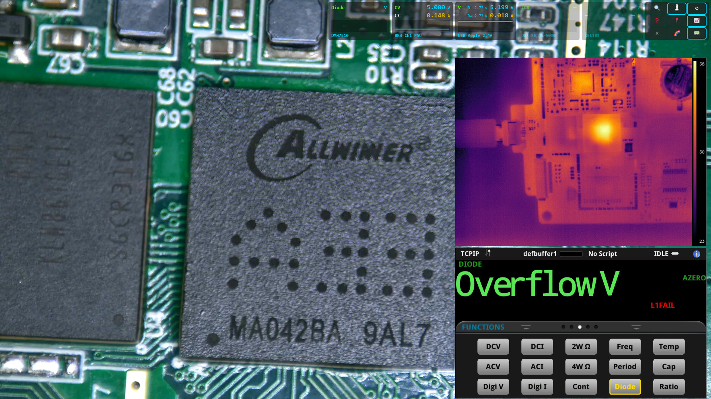

# LabCam PC

PC-side companion services for **LabCam**, an electronics-lab measurement setup.
They turn a bench full of instruments and USB cameras into live, network-readable
data and a browser dashboard, and they back the phone app
([labcam-phone](../labcam-phone)) and its component-identification feature.

This repository bundles four small, independent components:

| Folder                 | What it is                                                                 | Lang   | Port |
|------------------------|---------------------------------------------------------------------------|--------|------|
| `instruments-backend/` | Polls the bench instruments and broadcasts their readings as JSON over a WebSocket | Python | 7891 |
| `web/`                 | Browser dashboard (instrument panels + IR camera + scope + DMM front panel) | JS + Python | 8080 |
| `thermal/`             | Serves an HT-301 thermal camera as a calibrated °C MJPEG stream            | Python | 7896 |
| `component-id/`        | HTTP service that identifies a component in an image via the Claude vision API | Python | 7895 |

---

<p align="center">
 
 


</p>

---


## ⚠️ Status & security notice

This is a **proof-of-concept (POC) / work-in-progress (WIP)**, shared for interest
and reference — not a finished product.

It was built and used **only on a private, isolated lab network with no exposure to
the outside world**, so **information security was deliberately not a design goal**.
Concretely:

* The services have **no authentication, no transport encryption (plain HTTP/WS),
  no input hardening and no access control.** CORS is wide open (`*`).
* Some credentials are handled in plaintext / via environment variables, and one
  device login is proxied with a static credential.
* The services trust whatever they receive and run with whatever privileges you
  give them.

**Do not expose any part of this on an untrusted network or the public internet.**
Run it only inside a trusted LAN. Use at your own risk.

---

## Architecture / data flow

```
  bench instruments (LAN/BLE)              HT-301 thermal cam (USB)
        │ SCPI/UDP/BLE                            │ V4L2
        ▼                                         ▼
 instruments-backend  ──ws://host:7891──┐     thermal/  ──:7896 MJPEG──┐
 (JSON STATE, ~5 Hz)                    │                              │
                                        ▼                              ▼
                              web/ dashboard (browser, :8080) ─────────┘
                                        ▲           │
                                        │           └── DMM Virtual Front Panel
                                        │               (proxied same-origin by web/serve.py)
              component-id (:7895) ◄────┴── ROI image POST /identify ──► Claude vision API

  The phone app (labcam-phone) is a parallel client of the same
  instruments-backend (:7891) and the same component-id service (:7895).
```

Every consumer (web dashboard, phone) is **read-only** against the instruments
backend; nothing writes back to the instruments through these services.

---

## Where are the instrument settings? (configuration map)

All device addresses and service endpoints live in **plain config files** — no
build step, just edit and restart.

### Instrument addresses → `instruments-backend/config.py`

This is the single place for the **bench instruments**:

```python
DMM = ("192.168.10.45", 5025)      # multimeter (TCP/SCPI)
BB3 = ("192.168.10.78", 5025)      # PSU, both channels (TCP/SCPI)
KEL = ("192.168.10.83", 18190)     # electronic load (UDP)
C1_MAC = "AA:BB:CC:DD:EE:FF"       # USB power tester (BLE) — set your device MAC
WS_HOST, WS_PORT = "0.0.0.0", 7891 # WebSocket the clients connect to
# ... plus polling rates and reconnect backoff
```

Replace the example LAN IPs / the placeholder BLE MAC with your own devices and
restart `server.py`. The JSON STATE schema this produces is documented at the top
of `server.py` (keys `dmm`, `bb3a`, `bb3b`, `kel`).

### Dashboard endpoints → `web/config.js`

The browser dashboard derives the instrument-backend and component-ID hosts from
the page URL automatically, and has explicit URLs for the rest:

```js
identifyUrl : "http://" + host + ":7895/identify"   // component-id service
stateWsUrl  : "ws://"   + host + ":7891"            // instruments backend (read-only)
thermalUrl  : "http://" + host + ":7896/stream"     // HT-301 MJPEG
scopeUrl    : "http://192.168.10.32/..."            // oscilloscope web UI (fixed IP)
dmmUrl      : "/front_panel.html"                    // DMM front panel (same-origin proxy)
microUsbId  : "eba4:7588"                            // microscope camera USB vid:pid
```

### DMM web login → environment variables (for `web/serve.py`)

The DMM's Virtual Front Panel needs HTTP Basic auth, injected server-side so the
page can run same-origin:

```bash
export LABCAM_DMM_HOST=192.168.10.45        # DMM IP
export LABCAM_DMM_AUTH=youruser:yourpass     # default in code is the placeholder USER:PASSWORD
./serve.sh
```

### Thermal camera → environment variables (for `thermal/thermal.py`)

```bash
THERMAL_DEV_INDEX=2   # /dev/video<N> of the HT-301 (auto-detected by name otherwise)
THERMAL_PORT=7896
THERMAL_EMISSIVITY=0.95   # optional
```

### Component-ID service → `component-id/.env`

```bash
cp component-id/.env.example component-id/.env
# then edit:
ANTHROPIC_API_KEY=sk-ant-...          # required for real identification
COMPONENT_ID_MODEL=claude-sonnet-4-6  # optional override
PORT=7895
```

Without a key the service still runs and returns a stub card.

---

## Running the components

Each component is self-contained. Typical order on the lab PC:

```bash
# 1) instruments backend (data source for everything)
cd instruments-backend && pip install -r requirements.txt && python3 server.py

# 2) thermal camera stream (optional)
cd thermal && pip install numpy opencv-python && python3 thermal.py

# 3) component-id service (optional; needs .env with API key for real results)
cd component-id && ./run.sh        # creates a venv from requirements.txt

# 4) web dashboard
cd web && ./serve.sh               # http://127.0.0.1:8080/
```

> Browser camera access (`getUserMedia`, used for the microscope cam in the
> dashboard) only works in a *secure context* — i.e. via `http://127.0.0.1` /
> `localhost`, not over a LAN IP. The data/IR/scope/DMM views work over the LAN
> regardless.

---

## License

* **GPL-3.0-or-later** for this repository — see `LICENSE`.
* `thermal/ht301_hacklib.py` is a third-party module by **stawel**
  (<https://github.com/stawel/ht301_hacklib>), GPL-3.0 — it carries its own
  attribution header and is the reason the thermal component (and this bundle) is
  GPL-3.0.
* The component-ID service calls the **Anthropic Claude API**; you need your own
  API key (billed to you). The key is never stored in the repo (`.env` is
  gitignored).

---

## Relationship to the phone app

The phone app **labcam-phone** (a Sailfish OS camera fork) is a *client* of this
PC side: it reads the instruments WebSocket and POSTs ROI crops to the
component-ID service. The two repos share the JSON STATE schema (documented in
`instruments-backend/server.py`) and the component card schema (documented in
`component-id/API.md`).
